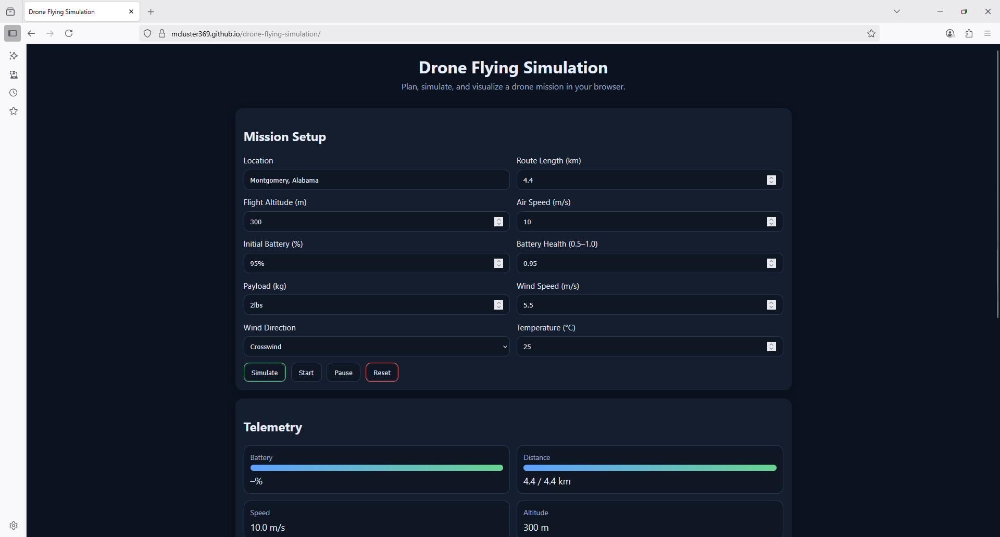
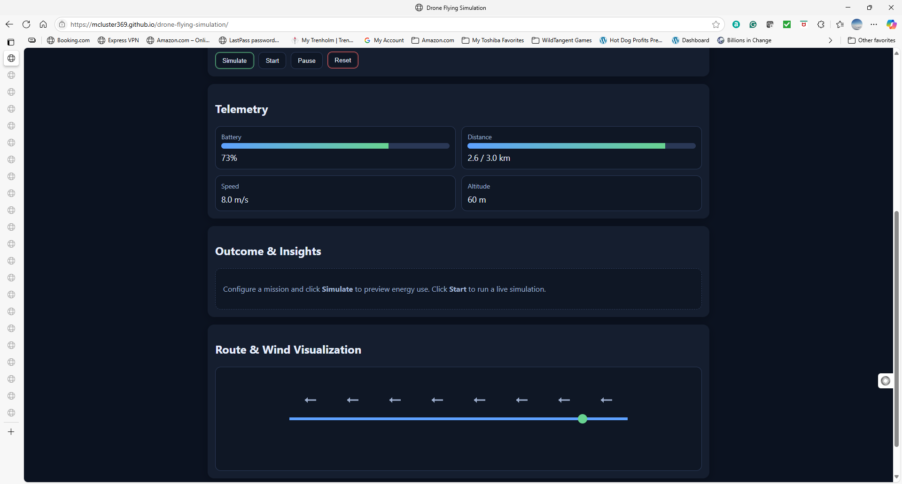

# 🚀 Drone Flying Simulation

🔗 **Live Demo:** [Click here to run the simulation](https://Mcluster369.github.io/drone-flying-simulation/)

---

## 📌 Overview
Drone Flying Simulation is an interactive web application that allows users to simulate flying a drone by entering mission details such as location, weather, altitude, payload, and battery levels.  
The app uses JavaScript to calculate responses in real time, providing both a quick simulation and a live telemetry-based simulation.

---

## ✨ Features
- Enter mission details (location, weather, altitude, payload, battery).  
- **Quick Simulation**: instant calculation of flight time, range, and risk level.  
- **Live Simulation**: step-by-step telemetry updates with dynamic visualization.  
- Object-oriented JavaScript design with reusable functions.  
- Fully responsive, runs in any modern browser.  

---

## 🛠️ How to Use
1. Open the [Live Demo](https://Mcluster369.github.io/drone-flying-simulation/).  
2. Enter your mission details.  
3. Choose **Quick Simulate** for instant results.  
4. Choose **Run Simulation** for live updates and flight progression.  

---

## 📸 Screenshots
  
*Starting screen with mission setup form.*

  
*Results after running a quick simulation.*

  
*Telemetry updates during live simulation.*

  
*Mission finished with results summary.*

---

## 💻 Tech Stack
- **HTML5** for structure  
- **CSS3** for styling  
- **JavaScript (ES6)** for logic, objects, and simulation  
- **GitHub Pages** for hosting  

---

## 📂 Repository Contents
- `index.html` – main page  
- `style.css` – styles and layout  
- `script.js` – JavaScript logic for simulation  
- `screenshots/` – demo images  
- `README.md` – project overview  
- `readme.txt` – assignment-specific instructions  

---

## ✅ Project Status
- Fully working  
- Meets all rubric requirements (30%+ JavaScript, objects, reusable functions, GitHub repo, screenshots, readme.txt, excellent UX).  
