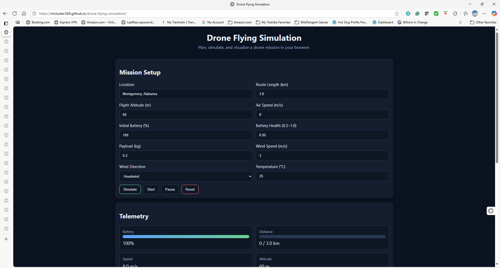

# Drone Flying Simulation


An interactive, browser-based simulator that models a simple drone mission using **HTML, CSS, and JavaScript**. Users can configure mission parameters—**location, route length, altitude, speed, payload, battery, weather**—and simulate **energy use** and **mission outcome** in real time.

> Built to satisfy **Assignment 7.1: Final Project & Presentation**. 30%+ of the project is JavaScript, object-oriented, dynamic, and UX-focused.

---

## ✨ Features (Rubric Mapping)

- **30%+ JavaScript** with reusable functions & OOP classes (`Drone`, `Environment`, `Mission`).
- **Dynamic UI**: live simulation loop (battery %, distance, progress) + `<canvas>` route & wind visualization.
- **Object manipulation**: mission/env/drone objects passed into pure functions and controller.
- **Excellent UX**: clean, responsive layout, accessible contrast, clear labels, actionable tips.
- **Stand-alone** website: open `index.html`—no build steps.
- **Coding standards**: comments, indentation, separation of concerns.
- **Multi-browser**: works on Chrome & Firefox (also Edge/Safari).
- **GitHub**: intended for a public repo with screenshots.

---

## 🔧 Tech

- **HTML5** for layout
- **CSS3** for responsive styling
- **Vanilla JavaScript** (no frameworks) for simulation logic and canvas rendering

---

## 📂 Project Structure

```
drone-flying-simulation/
├── index.html      # UI and layout
├── style.css       # Styling (responsive, accessible)
├── script.js       # Simulation logic, objects, reusable helpers
└── readme.txt      # Plaintext instructions
```

This repo also includes this Markdown `README.md` (richer version for GitHub).

---

## ▶️ Getting Started (Local)

1. **Download** this folder or **clone** your GitHub repo.
2. **Open** `index.html` in a modern browser (Chrome/Firefox recommended).
3. Set mission inputs → click **Simulate** to preview, or **Start** for a live run.
4. Use **Pause** / **Reset** as needed.

> Works without any server—pure client-side.

---

## 🌐 Deploy (GitHub Pages)

1. Push the project to a **public** GitHub repo (e.g., `drone-flying-simulation`).  
2. In your repo: **Settings → Pages → Build and deployment**  
   - Source: `Deploy from a branch`  
   - Branch: `main` (root)  
3. Wait for Pages to deploy. Copy the site URL and add it to your assignment submission.
4. **Rubric proof**: add a **screenshot** of your GitHub repo (showing commits) to your submission.

---

## 🧪 Usability Testing Checklist

Ask friends/family to try:
- Switch **Headwind ↔ Tailwind** and watch battery impact.
- Increase **Payload** and **Speed** → observe power usage & completion status.
- Lower **Battery Health** and **Initial Battery** → verify early aborts.
- Confirm it renders in **two browsers**.

---

## 🧠 How the Simulation Works (High-Level)

- Power model ≈ baseline hover + speed^3 aerodynamic term + payload penalty  
  + wind effect (headwind > crosswind; tailwind can help)  
  + altitude & temperature modifiers.
- Battery drain is derived from power (W) → Wh/s → mapped to % using battery health.
- Live loop updates **once per second** and redraws `<canvas>` with progress & wind.

> Educational approximation, **not** a real flight planner.

---

## 🧭 Demo Script (for your presentation video)

See **Demo_Script.pdf** in this repo for a slide-by-slide narration to meet the “Final Project Presentation” rubric requirement.

---

## ✅ Rubric Checklist

- [x] Easy to understand and use UI (Excellent UX)
- [x] Solution is working
- [x] Solution meets requirements (JS %, dynamic, objects, reusable functions)
- [x] Coding standards used (comments, indentation, structure)
- [x] Deployment problem-free; correct files
- [x] Code not duplicated, helpers shared
- [x] Good solution design (separation of concerns + OOP)
- [x] Checked into GitHub (add screenshot in submission)
- [x] **Includes a README** with setup & start instructions
- [x] Final Project Presentation video link submitted

---

## 📸 Screenshots

Below are placeholder screenshots (replace with real ones after recording):




## 📸 Screenshots (Add in your repo)

Create a `/screenshots` folder and add images like:
- `screenshots/01-home.png` – Form + default values
- `screenshots/02-simulated.png` – Simulate result message
- `screenshots/03-running.png` – Live run with progress & battery
- `screenshots/04-complete.png` – Completed mission summary

Then reference them directly in the README (example):

```


```

---

## 👤 Author

**Hosheyah Yisrael**  
Assignment 7.1 – Final Project & Presentation (2025)

---

## 📝 License

MIT License
